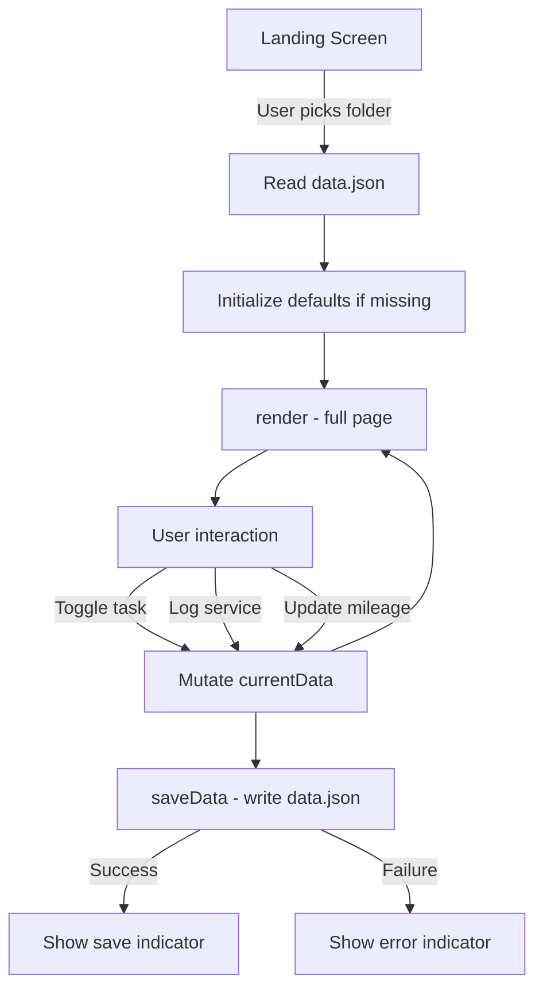

# Design Document: Maintenance Tracker Redesign

## Overview

This design covers two interrelated changes to the 1997 Volvo S90 Build Tracker application:

1. **Maintenance Tracker Panel** — A new UI section that displays six recurring vehicle maintenance items (oil change, timing belt, coolant flush, transmission fluid, brake fluid, spark plugs) with color-coded status indicators, inline service logging, and current mileage entry. The panel sits between the hero/overall-progress section and the stage cards.

2. **Visual Design Overhaul** — A shift from the current dark, glow-heavy aesthetic to a brighter, flatter, more professional look while preserving all existing functionality.

The application is a single `index.html` file with inline CSS and JavaScript. It uses the File System Access API to read/write `data.json`. There are no build tools, frameworks, or external JS dependencies. All changes happen within this single file.

### Design Decisions

- **No framework introduction.** The app is vanilla JS with string-template rendering. We keep that pattern for the maintenance panel rather than introducing a framework.
- **Backward-compatible data migration.** When loading a `data.json` that lacks the `maintenance` key or `currentMileage` field, the app initializes defaults in memory and persists them on the next save. This avoids breaking existing data files.
- **Mileage-based vs. date-based items are distinguished by field presence** (`intervalMiles`/`lastMiles` vs. `intervalMonths`/`lastDate`), not by a `type` discriminator field. This keeps the schema minimal and the rendering logic uses duck typing.
- **Inline editing pattern.** Clicking a maintenance item or the mileage display swaps the display text for an input field. Pressing Enter or blurring the input commits the value. Escape cancels. This matches the lightweight, no-modal approach of the existing task toggle pattern.

## Architecture

The application follows a simple read → render → mutate → save cycle, all within a single HTML file:



### Key Architectural Constraints

- **Single render function.** The existing `render(data)` function rebuilds the entire `#app` innerHTML on every change. The maintenance panel will be added as a new section within this render function, inserted between the overall-progress bar and the `main-content` div.
- **Global state.** `currentData` holds the full data.json object in memory. Maintenance mutations modify `currentData.maintenance` and `currentData.meta.currentMileage` directly, then trigger `render()` + `saveData()`.
- **No component isolation.** Since there's no framework, each "component" is a render function that returns an HTML string. New functions: `renderMaintenancePanel(data)`, `renderMaintenanceItem(item, currentMileage)`.

## Components and Interfaces

### New JavaScript Functions

#### `initializeDefaults(data)`
Called after `readData()`. Checks for missing `maintenance` array and `currentMileage` field, adding defaults if absent.

```
Input:  data object (parsed from data.json)
Output: data object (mutated in place with defaults added)
```

Default maintenance items:
| id | label | intervalMiles | intervalMonths | lastMiles | lastDate |
|---|---|---|---|---|---|
| oil-change | Oil Change | 3000 | — | null | — |
| timing-belt | Timing Belt + Water Pump | 70000 | — | 133800 | — |
| coolant-flush | Coolant Flush | — | 36 | — | 2025-03-15 |
| trans-fluid | Transmission Fluid | 30000 | — | null | — |
| brake-fluid | Brake Fluid | — | 24 | — | null |
| spark-plugs | Spark Plugs | 30000 | — | null | — |

#### `computeStatus(item, currentMileage)`
Pure function. Computes the status color for a single maintenance item.

```
Input:  item (maintenance item object), currentMileage (number | null)
Output: { status: 'green' | 'amber' | 'red', dueMiles?: number, dueDate?: string, remaining?: number | string }
```

Logic:
- If item has no last-service record → `amber`
- If mileage-based and `currentMileage` is null → `amber`
- Mileage-based: `dueMiles = lastMiles + intervalMiles`, `remaining = dueMiles - currentMileage`
  - remaining > 10% of interval → `green`
  - remaining >= 0 and <= 10% of interval → `amber`
  - remaining < 0 → `red`
- Date-based: `dueDate = lastDate + intervalMonths`, `remainingDays = dueDate - today`
  - remainingDays > 60 → `green`
  - remainingDays >= 0 and <= 60 → `amber`
  - remainingDays < 0 → `red`

#### `renderMaintenancePanel(data)`
Returns HTML string for the entire maintenance panel section.

```
Input:  data object (full currentData)
Output: HTML string
```

Renders:
- Section heading ("Maintenance Tracker")
- Current mileage display (clickable for inline edit)
- Grid of 6 maintenance item cards

#### `renderMaintenanceItem(item, currentMileage)`
Returns HTML string for a single maintenance item card.

```
Input:  item (maintenance item object), currentMileage (number | null)
Output: HTML string
```

Renders:
- Item label
- Status indicator dot/bar (green/amber/red)
- "Last" value (mileage or date, or "Not recorded")
- "Due" value (computed next service, or "Set mileage/date to calculate")
- Click handler for inline service logging

#### `updateMileage(value)`
Validates and saves a new current mileage value.

```
Input:  value (string from input field)
Side effects: Updates currentData.meta.currentMileage, calls render() + saveData()
```

Validation: must be a positive integer. Rejects non-numeric, zero, negative, or decimal values.

#### `logService(itemId, value)`
Validates and saves a service log entry for a maintenance item.

```
Input:  itemId (string), value (string from input field)
Side effects: Updates the item's lastMiles or lastDate, calls render() + saveData()
```

Validation:
- Mileage items: must be a positive integer
- Date items: must be a valid ISO 8601 date string (YYYY-MM-DD)

### Modified Functions

#### `openFolder()` (modified)
After `readData()`, calls `initializeDefaults(data)` before assigning to `currentData` and calling `render()`.

#### `render(data)` (modified)
Inserts `renderMaintenancePanel(data)` HTML between the overall-progress section and the `main-content` div in the template string.

### New CSS

- `.maintenance-panel` — Container for the maintenance section, max-width 960px, centered
- `.maintenance-header` — Section heading row with title and mileage display
- `.mileage-display` — Clickable current mileage value, inline-editable
- `.maintenance-grid` — CSS Grid layout for the 6 item cards (3 columns on desktop, 2 on tablet, 1 on mobile)
- `.maint-card` — Individual maintenance item card with status border/indicator
- `.maint-card.status-green`, `.maint-card.status-amber`, `.maint-card.status-red` — Color variants
- `.maint-label`, `.maint-detail`, `.maint-value` — Typography within cards
- Updated `:root` CSS variables for the brighter color palette

### Visual Design Changes (CSS)

The redesign updates the `:root` CSS custom properties and removes/replaces specific style rules:

| Element | Current | New |
|---|---|---|
| `--bg` | `#0f1117` (near-black) | `#f5f6fa` (light gray) |
| `--bg-card` | `#161b27` (dark blue-gray) | `#ffffff` (white) |
| `--bg-hover` | `#1e2640` | `#f0f1f5` |
| `--text-primary` | `#e8eaf0` (light) | `#1a1d26` (dark) |
| `--text-secondary` | `#8b93a8` | `#5f6880` |
| `--text-muted` | `#4a5268` | `#9ca3b4` |
| `--border` | `rgba(255,255,255,0.07)` | `rgba(0,0,0,0.08)` |
| `--border-card` | `rgba(255,255,255,0.1)` | `rgba(0,0,0,0.1)` |
| `--shadow` | Heavy dark shadow | `0 1px 3px rgba(0,0,0,0.08)` |
| `--shadow-lg` | Heavier dark shadow | `0 4px 12px rgba(0,0,0,0.1)` |
| Glow effects | `box-shadow` glows on accent elements | Removed or replaced with subtle borders |
| Hero background | Dark gradient with radial glows | Clean light gradient or solid with subtle accent |
| Landing background | Dark gradient | Light gradient matching new palette |
| Progress bar glow | `box-shadow: 0 0 12px` | No glow, solid fill only |
| Animated pulse dots | Glow + scale animation | Solid dot, no glow shadow |

The Inter font family and all responsive breakpoints (`600px`, `768px`) remain unchanged.

## Data Models

### Updated `data.json` Schema

```json
{
  "meta": {
    "title": "string",
    "subtitle": "string",
    "stockHp": "number",
    "goalHp": "number",
    "stockTorque": "number",
    "goalTorque": "number",
    "currentMileage": "number | null"
  },
  "stages": [ "...existing stage objects..." ],
  "maintenance": [
    {
      "id": "string",
      "label": "string",
      "intervalMiles": "number",
      "lastMiles": "number | null"
    },
    {
      "id": "string",
      "label": "string",
      "intervalMonths": "number",
      "lastDate": "string (ISO 8601) | null"
    }
  ]
}
```

### Mileage-Based Item Shape

```javascript
{
  id: "oil-change",           // unique identifier
  label: "Oil Change",        // display name
  intervalMiles: 3000,        // service interval in miles
  lastMiles: null             // odometer at last service, or null
}
```

### Date-Based Item Shape

```javascript
{
  id: "coolant-flush",        // unique identifier
  label: "Coolant Flush",     // display name
  intervalMonths: 36,         // service interval in months
  lastDate: "2025-03-15"     // ISO 8601 date of last service, or null
}
```

### Type Discrimination

Items are distinguished by field presence:
- Has `intervalMiles` → mileage-based item
- Has `intervalMonths` → date-based item

This is checked in `computeStatus()` and `renderMaintenanceItem()` with a simple `'intervalMiles' in item` test.

### Default Initialization Data

When `data.maintenance` is missing, the app creates:

```javascript
[
  { id: "oil-change",    label: "Oil Change",               intervalMiles: 3000,  lastMiles: null },
  { id: "timing-belt",   label: "Timing Belt + Water Pump", intervalMiles: 70000, lastMiles: 133800 },
  { id: "coolant-flush", label: "Coolant Flush",            intervalMonths: 36,   lastDate: "2025-03-15" },
  { id: "trans-fluid",   label: "Transmission Fluid",       intervalMiles: 30000, lastMiles: null },
  { id: "brake-fluid",   label: "Brake Fluid",              intervalMonths: 24,   lastDate: null },
  { id: "spark-plugs",   label: "Spark Plugs",              intervalMiles: 30000, lastMiles: null }
]
```

When `data.meta.currentMileage` is missing, it is set to `null`.


## Correctness Properties

*A property is a characteristic or behavior that should hold true across all valid executions of a system — essentially, a formal statement about what the system should do. Properties serve as the bridge between human-readable specifications and machine-verifiable correctness guarantees.*

### Property 1: Initialization preserves existing data and adds correct defaults

*For any* valid data object that contains `meta` and `stages` keys but is missing the `maintenance` key or `meta.currentMileage` field, calling `initializeDefaults` SHALL produce a data object where: (a) the original `meta` fields (title, subtitle, stockHp, goalHp, stockTorque, goalTorque) are unchanged, (b) the original `stages` array is unchanged, (c) `maintenance` is an array of exactly 6 items with the correct default ids, labels, and intervals, and (d) `currentMileage` is `null` if it was previously missing.

**Validates: Requirements 1.3, 1.4**

### Property 2: Mileage validation accepts only positive integers

*For any* string input, the mileage validation function SHALL return true if and only if the string represents a positive integer (no decimals, no leading zeros except for the number itself, no negative sign, no non-numeric characters, no whitespace-only strings). For all other strings, it SHALL return false.

**Validates: Requirements 2.4, 2.5**

### Property 3: Mileage-based status computation is correct

*For any* mileage-based maintenance item with non-null `lastMiles`, non-null `currentMileage`, and positive `intervalMiles`, the `computeStatus` function SHALL return: `green` when `(lastMiles + intervalMiles - currentMileage) > 0.1 * intervalMiles`, `amber` when `0 <= (lastMiles + intervalMiles - currentMileage) <= 0.1 * intervalMiles`, and `red` when `(lastMiles + intervalMiles - currentMileage) < 0`. Additionally, the returned `remaining` value SHALL equal `(lastMiles + intervalMiles) - currentMileage`.

**Validates: Requirements 4.1, 4.2, 4.3, 6.1, 6.3**

### Property 4: Date-based status computation is correct

*For any* date-based maintenance item with non-null `lastDate`, positive `intervalMonths`, and a reference date (today), the `computeStatus` function SHALL return: `green` when the due date (lastDate + intervalMonths) is more than 60 days from today, `amber` when the due date is between 0 and 60 days from today (inclusive), and `red` when the due date is in the past. Additionally, the returned `remaining` value SHALL equal the number of days between today and the due date.

**Validates: Requirements 4.4, 4.5, 4.6, 6.2, 6.4**

### Property 5: Service logging updates the correct field with valid input and rejects invalid input

*For any* maintenance item and submitted value: if the item is mileage-based and the value is a valid positive integer, then `lastMiles` SHALL be updated to that integer; if the item is date-based and the value is a valid ISO 8601 date, then `lastDate` SHALL be updated to that date string; for all invalid inputs (non-numeric mileage, invalid date format), the item's last-service field SHALL remain unchanged.

**Validates: Requirements 5.4, 5.5, 5.6**

### Property 6: Maintenance changes preserve existing meta and stages data

*For any* data object and any maintenance mutation (updating currentMileage or logging a service), the `meta` fields other than `currentMileage` (title, subtitle, stockHp, goalHp, stockTorque, goalTorque) and the entire `stages` array SHALL be identical before and after the mutation.

**Validates: Requirements 8.4**

## Error Handling

### Input Validation Errors

| Scenario | Behavior |
|---|---|
| Non-numeric mileage input | Reject silently, retain previous value, no save triggered |
| Negative or zero mileage | Reject silently, retain previous value, no save triggered |
| Decimal mileage value | Reject silently, retain previous value, no save triggered |
| Empty string input | Reject silently, retain previous value, no save triggered |
| Whitespace-only input | Reject silently, retain previous value, no save triggered |
| Invalid date format | Reject silently, retain previous value, no save triggered |

### File System Errors

| Scenario | Behavior |
|---|---|
| `saveData` write fails | Show save indicator in error state ("Save failed"), data remains in memory |
| No folder handle (dirHandle is null) | Show save indicator error ("Save failed — no folder open") |
| `data.json` missing from folder | Caught by `openFolder`, alert shown to user |
| `data.json` contains invalid JSON | Caught by `readData`, error propagates to `openFolder` catch block |

### Data Migration Errors

| Scenario | Behavior |
|---|---|
| `maintenance` key missing | `initializeDefaults` adds default array — no error |
| `currentMileage` field missing | `initializeDefaults` sets to `null` — no error |
| `maintenance` key exists but is malformed | App uses it as-is; rendering may show unexpected values but won't crash (defensive rendering with `esc()` and null checks) |

### Inline Edit Cancellation

- Pressing Escape while editing mileage or logging a service dismisses the input and restores the previous display value.
- Clicking outside the input (blur) commits the value if valid, otherwise cancels.

## Testing Strategy

### Unit Tests (Example-Based)

Unit tests cover specific examples, edge cases, and UI rendering checks:

- **Initialization defaults**: Verify the 6 default items have correct ids, labels, intervals, and initial values (Req 1.3, 1.5, 1.6)
- **Null mileage display**: Verify "Set current mileage" prompt appears when currentMileage is null (Req 2.2)
- **Null last-service display**: Verify "Not recorded" and "Set mileage/date to calculate" text for null items (Req 3.5)
- **Null edge cases in computeStatus**: Verify amber status for null lastMiles, null lastDate, and null currentMileage (Req 4.7, 4.8, 6.5, 6.6)
- **Panel positioning**: Verify maintenance panel HTML appears between hero and stage cards in render output (Req 3.1)
- **Six items rendered**: Verify all 6 maintenance items appear in the panel (Req 3.2)
- **Section heading**: Verify "Maintenance Tracker" heading exists (Req 3.6)
- **Save error display**: Verify error indicator shown on write failure (Req 8.3)
- **CSS contrast ratios**: Verify text/background color pairs meet 4.5:1 WCAG AA (Req 7.7)

### Property-Based Tests

Property-based tests verify universal properties across many generated inputs. Each test runs a minimum of 100 iterations.

**Library:** [fast-check](https://github.com/dubzzz/fast-check) — the standard PBT library for JavaScript.

Since this is a single-file vanilla JS app with no build tools, property tests will be written in a standalone test file that extracts the pure functions (`computeStatus`, `initializeDefaults`, `validateMileage`, `logService` logic) into testable units. The test file can import these by either:
1. Extracting the pure functions into a shared `<script>` block that can be loaded by both the app and the test runner, or
2. Duplicating the pure function logic in the test file (acceptable for a small app with no module system).

Option 1 is preferred for maintainability.

**Test configuration:**
- Minimum 100 iterations per property test
- Each test tagged with: `Feature: maintenance-tracker-redesign, Property {N}: {title}`

| Property | Test Description | Generator Strategy |
|---|---|---|
| Property 1 | Generate random data objects with/without maintenance and currentMileage. Verify initializeDefaults output. | `fc.record({ meta: fc.record({...}), stages: fc.array(...) })` |
| Property 2 | Generate random strings. Verify validation accepts only positive integers. | `fc.string()`, `fc.integer()`, `fc.double()`, `fc.constantFrom('-1', '0', '3.5', 'abc', '', ' ')` |
| Property 3 | Generate random (lastMiles, intervalMiles, currentMileage) tuples. Verify status and remaining. | `fc.nat()` for mileage values, `fc.integer({min:1})` for intervals |
| Property 4 | Generate random (lastDate, intervalMonths, today) tuples. Verify status and remaining days. | `fc.date()` for dates, `fc.integer({min:1, max:120})` for months |
| Property 5 | Generate random items and input values (valid and invalid). Verify update or rejection. | `fc.oneof(fc.nat().map(String), fc.string())` for values |
| Property 6 | Generate random data objects, perform a maintenance mutation, verify meta/stages unchanged. | Full data object generators with before/after deep comparison |

### Integration Tests

- **File System Access API round-trip**: Open folder → read data → modify maintenance → save → re-read → verify (manual browser test)
- **Existing functionality preservation**: Verify task toggling, stage rendering, save indicator all work after redesign (Req 7.5)
- **Full render cycle**: Load data with maintenance → verify panel renders → log service → verify re-render (Req 5.7, 5.8)
